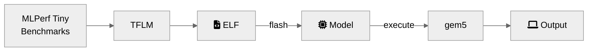
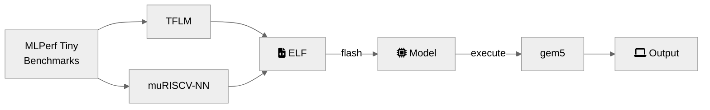

```mermaid
---
config:
  theme: neutral
---
flowchart LR
    A["MLPerf Tiny<br/>Benchmarks"] --> B["TFLM"]
    B --> C["fa:fa-file-code ELF"]
    C -- flash --> D["fa:fa-microchip Model"]
    D -- execute --> gem5    
    gem5 --> E["fa:fa-laptop Output"]
```

```mermaid
---
config:
  theme: neutral
---
flowchart LR
    A["MLPerf Tiny<br/>Benchmarks"] --> B["TFLM"]
    A --> F["muRISCV-NN"]
    B & F --> C["fa:fa-file-code ELF"]
    C -- flash --> D["fa:fa-microchip Model"]
    D -- execute --> gem5    
    gem5 -->  E["fa:fa-laptop Output"]
```